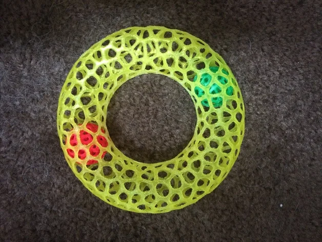

# Arduino Virtual Ball in Torus

This small Arduino construction reproduces the machanics of a (single) ball kept inside a torus. By moving the Arduino board itself accross the 6 dimansions, the ball circulates inside.

The behavior is calculated realtime by the processor, based on standard mechanics equations, using moment of inertia.

All calculations are based on Euler angles, in the canonical (first) approach based on the ZXZ angles: &#x03c8; (psi), &#x03b8; (theta) then &#x03c6; (phi). This picture from [Berkeley University](https://rotations.berkeley.edu/the-euler-angle-parameterization/) explains the used notation.

Assuming a fixed board, where its z axis points verticaly upward, the only moment is from the gravity force:

&nbsp;&nbsp;&nbsp;&nbsp;

Then as the board is actually a non galilean referencial, the moment of virtual forces appply too. First as the referential translates along the 3 axis, the monent of the inertia force applies. As the referential rotates, the 3 new virtual forces are the Euler force, the Coriolis force and the centrifugal force. The 3 forces are explained [here](https://en.wikipedia.org/wiki/Coriolis_force#Formula).

&nbsp;&nbsp;&nbsp;&nbsp;

The moment of the 4 virtual forces are equal to:

&nbsp;&nbsp;&nbsp;&nbsp;

So the complete equation is:

&nbsp;&nbsp;&nbsp;&nbsp;

I have calculated all the equations myself, so if you find any error, please contact me!

Thank you to [STLFinder](https://www.stlfinder.com/model/voronoi-donut-with-holes-inside-saX8Zuwv/659237/) for the picture of the toy.